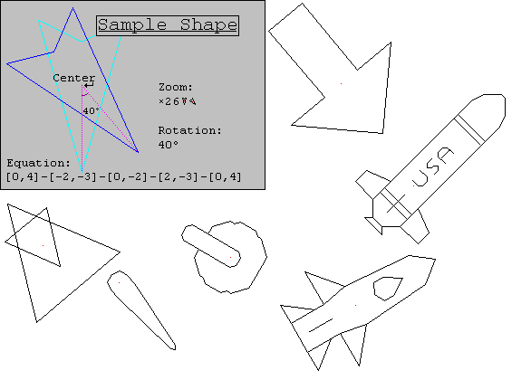



## Custom Rotating Graphics

### Description

Allows the user to create shapes supported by a programming script, which are easy to rotate and zoom into. In the screen shot, you will see one such shape and it's formula. In this screen shot, I chose to display a boring graphic, and if you download this, you will see that surely great projects could be made with this code. I have programmed shapes for arrows, and gauges, airplanes, and a nuclear missile with the name "USA" on top. And they are all non-flicker graphics, easily rotated, and extremely quick.
 
### More Info
 
No API calls!!! Just concentrated mathematics!

A readme file will describe some ways in how to use this control. I have tried hard to install form into the control, so that it would be easy to read and that a user not familiar with the code may see the coments and know exactly what is going on.

             |
---                |---
**Submitted On**   |2000-06-14 14:38:24
**By**             |[Jon Feucht](https://github.com/Planet-Source-Code/PSCIndex/blob/master/ByAuthor/jon-feucht.md)
**Level**          |Advanced
**User Rating**    |5.0 (20 globes from 4 users)
**Compatibility**  |VB 5\.0, VB 6\.0
**Category**       |[Custom Controls/ Forms/  Menus](https://github.com/Planet-Source-Code/PSCIndex/blob/master/ByCategory/custom-controls-forms-menus__1-4.md)
**World**          |[Visual Basic](https://github.com/Planet-Source-Code/PSCIndex/blob/master/ByWorld/visual-basic.md)
**Archive File**   |[CODE\_UPLOAD67776142000\.zip](https://github.com/Planet-Source-Code/jon-feucht-custom-rotating-graphics__1-8920/archive/master.zip)

